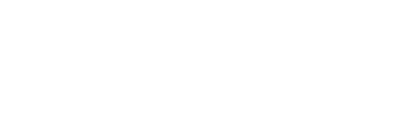
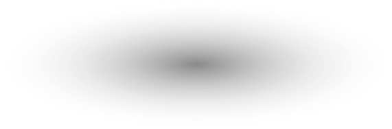
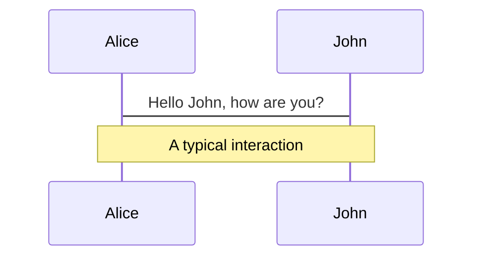
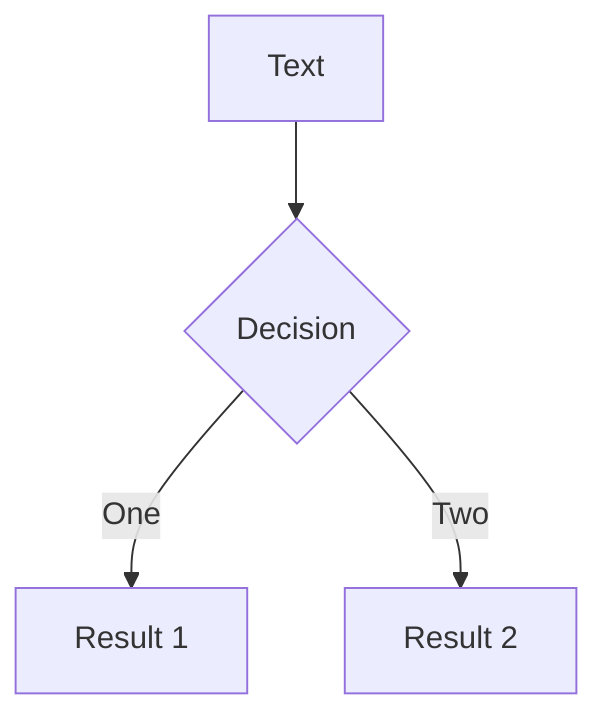
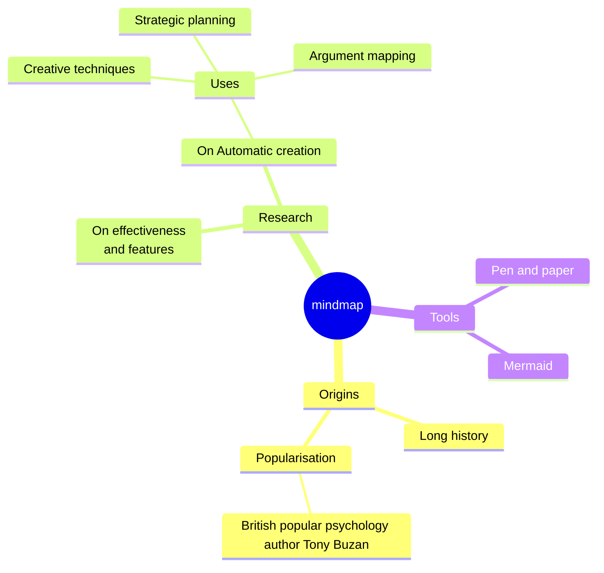
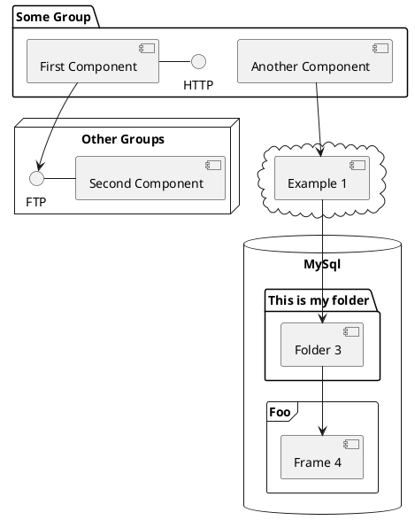

# Health Check-in App

Your teams primary tool to track work health

::right::

<div class='w-full h-full relative'>
  <div class="relative">
      
      <LightOrDark>
        <template #dark>
          
        </template>
        <template #light>
          
        </template>
      </LightOrDark>
    </div>
    <div
      class="text-5xl absolute top-14 left-40 text-[#2B90B6] z-10"
      v-motion
      :initial="{ x: -80, opacity: 0}"
      :click-2="{ x: 25, opacity: 1, transition: { delay: 500, duration: 1000 } }">
      Health Check-In
    </div>
  </div>

<style>
  .grid-cols-2 {
    display: flex;
    justify-content: center;
    align-items: center;
  }
</style>

<!--
It's important that members of a team work in an effient way that is also good for the health in the long term. With todays presentation I'm going to talk about the health check-in App that will allow you to keep track of your teams and yourselfs work health regarding Happiness, Productivity and Stress. Let's check it out!
-->

---
transition: slide-up
level: 2
---

# Core concept

<div class="flex flex-col justify-center relative w-full">
  <code class="w-full">
    [
      <br>
      { id: 1, name: "Happiness" },
      <br>
      { id: 2, name: "Productiviy"},
      <br>
      { id: 3, name: "Stress" }
      <br>
    ]
  </code>
  <div class="w-full h-full">
      <div
        v-motion
        :initial="{ x: -300, opacity: 0, scale: 0.5 }"
        :click-1="{ x: 0, y: 130, opacity: 1, scale: 0.9, transition: { duration: 600 } }"
        class="absolute left-0 top-0 z-1 w-full h-[300px] bg-white opacity-20 rounded-md px-4 mx-4"
      >
        <Chart/>
      </div>
  </div>
</div>

<style>
  .chart-container canvas {
    background-color: rgba(255, 255, 255, 1); /* White background color */
  }
</style>

<!--
Presenter note with **bold**, *italic*, and ~~striked~~ text.

Also, HTML elements are valid:
<div class="flex w-full">
  <span style="flex-grow: 1;">Left content</span>
  <span>Right content</span>
</div>
-->

---
transition: fade-out
layout: full
---

# The Why?

<h2 class="p-4 mb-3">Health check-in is a tool that is made for you and your team, it consist of the following features:</h2>
    <div
      class="text-4xl absolute top-14 left-40"
      v-motion
      :initial="{ x: -100, opacity: 0}"
      :click-1="{ x: -65, y:135, opacity: 1, transition: { delay: 500, duration: 1000 } }">
- 🕒 Sessions
    </div>
    <div
      class="text-4xl absolute top-14 left-40"
      v-motion
      :initial="{ x: -100, opacity: 0}"
      :click-2="{ x: -65, y:235, opacity: 1, transition: { delay: 500, duration: 1000 } }">
- 📊 Team Health
    </div>
    <div
      class="text-4xl absolute top-14 left-40"
      v-motion
      :initial="{ x: -100, opacity: 0}"
      :click-3="{ x: -65, y:335, opacity: 1, transition: { delay: 500, duration: 1000 } }">
- 📈 Your Health
    </div>
    <div
      class="text-4xl absolute top-14 left-40"
      v-motion
      :initial="{ x: -100, opacity: 0}"
      :click-4="{ x: 265, y:135, opacity: 1, transition: { delay: 300, duration: 1000 } }">
- 💡 Interactive
    </div>
    <div
      class="text-4xl absolute top-14 left-40"
      v-motion
      :initial="{ x: -100, opacity: 0}"
      :click-4="{ x: 265, y:235, opacity: 1, transition: { delay: 500, duration: 1000 } }">
- 🧑‍💻 Bontouch Exclusive
    </div>
    <div
      class="text-4xl absolute top-14 left-40"
      v-motion
      :initial="{ x: -100, opacity: 0}"
      :click-4="{ x: 265, y:335, opacity: 1, transition: { delay: 700, duration: 1000 } }">
- 🤳 mobile Responsiveness
    </div>

<style>
h1 {
  background-color: #2B90B6;
  background-image: linear-gradient(45deg, #4EC5D4 10%, #146b8c 20%);
  background-size: 100%;
  -webkit-background-clip: text;
  -moz-background-clip: text;
  -webkit-text-fill-color: transparent;
  -moz-text-fill-color: transparent;
}
</style>

<!--
1. Make sessions as points in time (Retro, Sprint planning) where you'd like a team to input their health factors
2. Track the health of your team(s) over time
3. Your inputs that you fill in per session/team is stored on your individual page where you can track it
4. Join any team you like, or create your own
5. Only a valid bontouch email adress can sign up
6. Made for mobile screens
-->

---
layout: iframe-right
backgroundSize: 5em 20%

# the web page source
url: https://health-checkin.vercel.app/

# a custom class name to the content
class: my-cool-content-on-the-left
id: my-coolest-id
---

<div class="">

# The How

- `Auth0` handle user authorization
- `Vercel postgresql` handle user management

#### The web app track these health indicators

|                         |                                                               |
| ----------------------- | ------------------------------------------------------------- |
| <kbd>Happiness</kbd>    | Perceived enjoyment of working on this project with this team |
| <kbd>Productivity</kbd> | Your sense of value that you feel you bring to the project    |
| <kbd>Stress</kbd>       | Feeling of stress when you work on the project                |

</div>

<style>
  body {
    height: 118%;
    width: 65%;
    margin-left: 5rem;
    background-color: black;
  }
</style>

---
layout: two-cols
layoutClass: gap-16
image: mountain.jpg
---

# Table of contents

You can use the `Toc` component to generate a table of contents for your slides:

```html
<Toc minDepth="1" maxDepth="1"></Toc>
```

The title will be inferred from your slide content, or you can override it with `title` and `level` in your frontmatter.

::right::

<Toc v-click minDepth="1" maxDepth="2"></Toc>

---
layout: image-right
image: mountain.jpg
---

# Code

Use code snippets and get the highlighting directly, and even types hover![^1]

```ts {all|5|7|7-8|10|all} twoslash
// TwoSlash enables TypeScript hover information
// and errors in markdown code blocks
// More at https://shiki.style/packages/twoslash

import { computed, ref } from "vue";

const count = ref(0);
const doubled = computed(() => count.value * 2);

doubled.value = 2;
```

<arrow v-click="[4, 5]" x1="350" y1="310" x2="195" y2="334" color="#953" width="2" arrowSize="1" />

<!-- This allow you to embed external code blocks -->

<<< @/snippets/external.ts#snippet

<!-- Footer -->

[^1]: [Learn More](https://sli.dev/guide/syntax.html#line-highlighting)

<!-- Inline style -->
<style>
.footnotes-sep {
  @apply mt-5 opacity-10;
}
.footnotes {
  @apply text-sm opacity-75;
}
.footnote-backref {
  display: none;
}
</style>

<!--
Notes can also sync with clicks

[click] This will be highlighted after the first click

[click] Highlighted with `count = ref(0)`

[click:3] Last click (skip two clicks)
-->

---

## level: 2

# Shiki Magic Move

Powered by [shiki-magic-move](https://shiki-magic-move.netlify.app/), Slidev supports animations across multiple code snippets.

Add multiple code blocks and wrap them with <code>````md magic-move</code> (four backticks) to enable the magic move. For example:

````md magic-move
```ts {*|2|*}
// step 1
const author = reactive({
  name: "John Doe",
  books: [
    "Vue 2 - Advanced Guide",
    "Vue 3 - Basic Guide",
    "Vue 4 - The Mystery",
  ],
});
```

```ts {*|1-2|3-4|3-4,8}
// step 2
export default {
  data() {
    return {
      author: {
        name: "John Doe",
        books: [
          "Vue 2 - Advanced Guide",
          "Vue 3 - Basic Guide",
          "Vue 4 - The Mystery",
        ],
      },
    };
  },
};
```

```ts
// step 3
export default {
  data: () => ({
    author: {
      name: "John Doe",
      books: [
        "Vue 2 - Advanced Guide",
        "Vue 3 - Basic Guide",
        "Vue 4 - The Mystery",
      ],
    },
  }),
};
```

Non-code blocks are ignored.

```vue
<!-- step 4 -->
<script setup>
const author = {
  name: "John Doe",
  books: [
    "Vue 2 - Advanced Guide",
    "Vue 3 - Basic Guide",
    "Vue 4 - The Mystery",
  ],
};
</script>
```
````

---

# Clicks Animations

You can add `v-click` to elements to add a click animation.

<div v-click>

This shows up when you click the slide:

```html
<div v-click>This shows up when you click the slide.</div>
```

</div>

<br>

<v-click>

The <span v-mark.red="3"><code>v-mark</code> directive</span>
also allows you to add
<span v-mark.circle.orange="4">inline marks</span>
, powered by [Rough Notation](https://roughnotation.com/):

```html
<span v-mark.underline.orange>inline markers</span>
```

</v-click>

<div mt-20 v-click>

[Learn More](https://sli.dev/guide/animations#click-animations)

</div>

---

# Diagrams

You can create diagrams / graphs from textual descriptions, directly in your Markdown.

<div class="grid grid-cols-4 gap-5 pt-4 -mb-6">









</div>

[Learn More](https://sli.dev/guide/syntax.html#diagrams)

---

# Monaco Editor

Slidev provides built-in Monaco Editor support.

Add `{monaco}` to the code block to turn it into an editor:

```ts {monaco}
import { ref } from "vue";
import hello from "./external";

const code = ref(hello());
```

Use `{monaco-run}` to create an editor that can execute the code directly in the slide:

```ts {monaco-run}
import { version } from "vue";

function fibonacci(n: number): number {
  return n <= 1 ? n : fibonacci(n - 1) + fibonacci(n - 2); // you know, this is NOT the best way to do it :P
}

console.log(
  version,
  Array.from({ length: 10 }, (_, i) => fibonacci(i + 1)),
);
```

---
layout: center
class: text-center
---

# Learn More

[Documentations](https://sli.dev) · [GitHub](https://github.com/slidevjs/slidev) · [Showcases](https://sli.dev/showcases.html)
